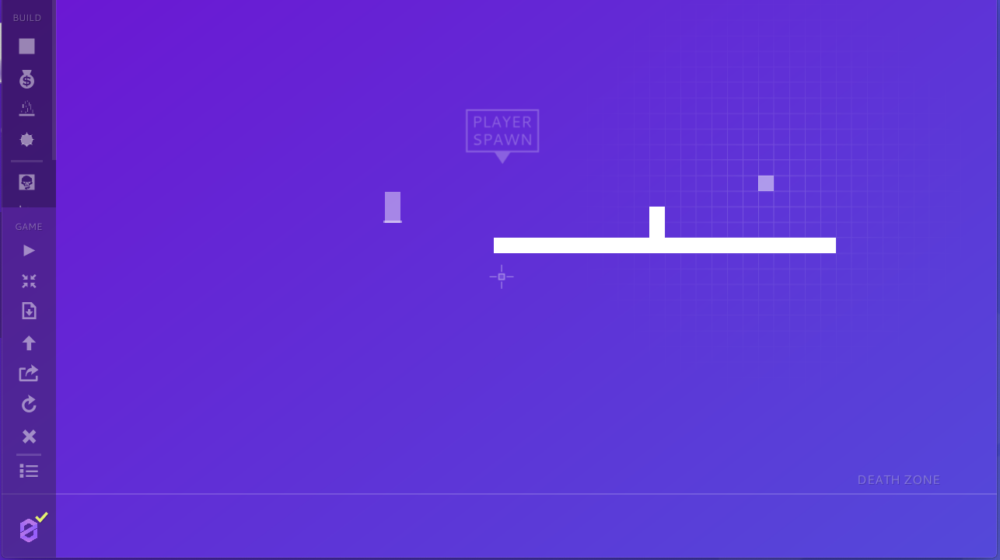
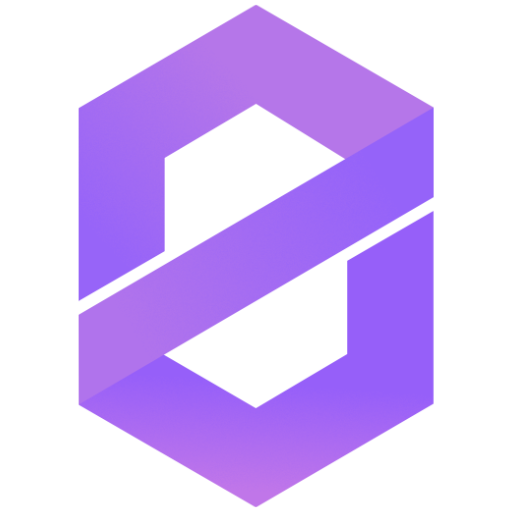

# ZAME - BUILD. SHARE. PLAY
*Example Game for the ZeroFrame Godot Engine addon.*

[Itch.io](https://lentsius-bark.itch.io/zame) link where you can download the game.

## Story
As we speak, right now, there is a network out there, a place where rules do not exist. A place where many gather without anyone noticing. You, who goes by the name Zame, are a young network adventurer who's decided to explore it. The road is right ahead and you dare take it!

## Features
* Upload/download maps through ZeroNet
* Level editor
* Play mode(platformer)

## Controls
* **WASD / ARROWS** - *move and jump (character)*
* **Mouse position** - *build position*
* **Mouse wheel** - *cycle through build tools*
* **LMB** - build
* **RMB** - delete
* **MMB/Touchpad** - *pan the view in Editor*

## Gameplay
Your aim is to get to the finish as quickly as possible. Overcome any of the hurdles and dangers laid out by the creator of the level and set a new time record.

## Level Editor
The editor allows you to fully build a level from ground up, from walking blocks, mines and jump pads to spawn location, finish and death zone. Our ideology is to give the creator the power to create a solid fun piece.

**Left panel** is where you'll find the full map editing arsenal as well as various options and controls for the level(reset, save, download, upload, login). On mouse over each button shows a tooltip describing what it does.

**Building** takes place exactly where you mouse pointer is located whereas placing/moving bits is done by the center of the screen where you will see a helpful crosshair pointing to the very location the item will snap to!

### You can build:

* solid blocks
* coins
* mines **evil, they kill!**
* jump pads
* AI platforms/enemies **these are fun!**

### You can move:

* player spawn
* finish
* death zone **So that you don't go** ***AAARGHRGHRRG!*** **right off the bat.**

## ZeroNet // and why you might want to use it

> *Open, free and uncensorable websites, using Bitcoin cryptography and BitTorrent network.*

Zame is an example game made for an [add-on](https://github.com/anoadragon453/godot-zeroframe-plugin) developed for [GodotEngine](https://godotengine.org) which enables the developers to communicate with [ZeroNet](https://zeronet.io), send/receive files and more. Zame represents a working example project which shows the possibilities as well as possible uses of the addon (getting/sending data, user check, call usage).

Sharing your masterpieces is easy with a running ZeroNet client, without it you can still enjoy playing levels that you've already made or downloaded previously.
